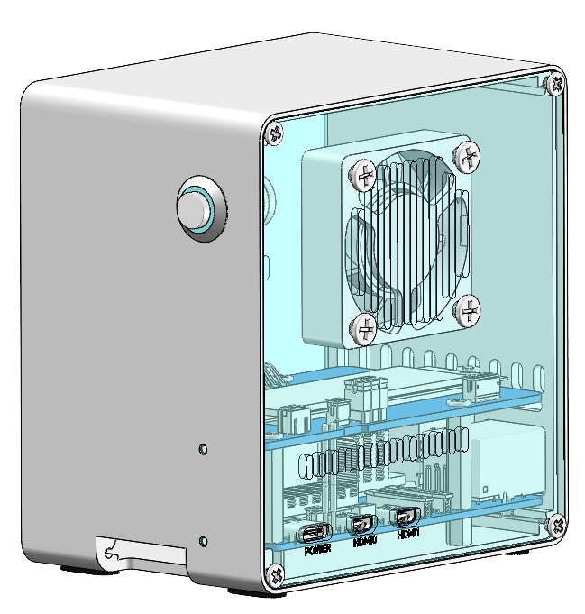

.. note::

    Hello, welcome to the SunFounder Raspberry Pi & Arduino & ESP32 Enthusiasts Community on Facebook! Dive deeper into Raspberry Pi, Arduino, and ESP32 with fellow enthusiasts.

    **Why Join?**

    - **Expert Support**: Solve post-sale issues and technical challenges with help from our community and team.
    - **Learn & Share**: Exchange tips and tutorials to enhance your skills.
    - **Exclusive Previews**: Get early access to new product announcements and sneak peeks.
    - **Special Discounts**: Enjoy exclusive discounts on our newest products.
    - **Festive Promotions and Giveaways**: Take part in giveaways and holiday promotions.

    👉 Ready to explore and create with us? Click [|link_sf_facebook|] and join today!

|link_pironman5_mini| - NVMe M.2 SSD PCIe Mini PC Case for Raspberry Pi 5
================================================================================

Thanks for choosing our |link_pironman5_mini|.

.. .. note::

..     This document is available in the following languages.

..     * |link_german_tutorials|         
..     * |link_jp_tutorials|
..     * |link_en_tutorials|
..     * |link_fr_tutorials|
..     * |link_es_tutorials|
..     * |link_it_tutorials|
    
..     Please click on the respective links to access the document in your preferred language.

    

Elevate your Raspberry Pi 5 with the |link_pironman5_mini|, our top-tier case designed for unmatched style and functionality. It's the perfect blend of aesthetics and performance:

* Raspberry Pi 5 mini PC
* An RGB Fans, with GPIO control
* An Active Cooler
* Supports four (PCIe Gen 2.0 / PCIe Gen 3.0) NVMe M.2 SSD sizes: 2230, 2242, 2260, and 2280.
* 4 WS2812 Addressable RGB LED light up the whole case with cool light effect
* Retro metal power button for safe shut down
* External GPIO extender with pin name label, for easy access
* Aluminum main body with clear Acrylic side panel
* Features two standard HDMI ports

The |link_pironman5_mini| is not just a case; it's an upgrade that transforms your Raspberry Pi 5 into a powerful, efficient, and stylish device. Get yours now and experience the future of Raspberry Pi cases!

.. note::

    You need to install an OS that supports Raspberry Pi 5. Please use the latest Raspberry Pi Imager tool for system installation. The currently tested systems are:

   .. image:: install/img/compitable_os.png

If you have any questions, please send an email to service@sunfounder.com and we will respond as soon as possible.

.. raw:: html

    

.. toctree::
    :maxdepth: 1

    About this Kit <self>
    what_do_we_need    
    assembly_instructions
    install/install_the_os
    set_up/set_up_pironman5
    control/control_pironman5
    advanced/advanced
    compitable_nvme_ssd
    faq

**Copyright Notice**

All contents including but not limited to texts, images, and code in this manual are owned by the SunFounder Company. You should only use it for personal study,investigation, enjoyment, or other non-commercial or nonprofit purposes, under therelated regulations and copyrights laws, without infringing the legal rights of the author and relevant right holders. For any individual or organization that uses these for commercial profit without permission, the Company reserves the right to take legal action.

